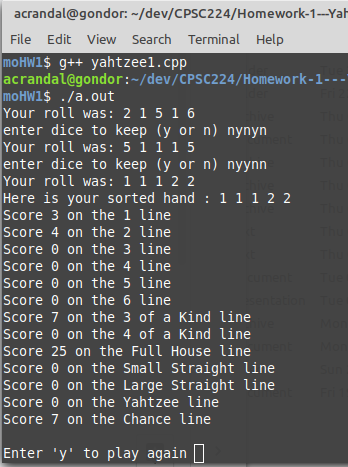

# Homework 1 - Yahtzee Rolling and Scoring

## CPSC 224 - Software Development - Gonzaga University

Yahtzee Game initial project with simple dice rolling and scoring a single hand.

### THE PROBLEM:

Produce a Java implemented equivalent of the yahtzee1.cpp C++ program available both in your GitHub Classroom repo as well as here: 
[https://github.com/worobec/Yahtzee](https://github.com/worobec/Yahtzee)

Execution and output of your solutions should be roughly identical to the C++ version, an example of which is shown below. That doesn’t mean that you should just copy the C++ code verbatim, even though that would work relatively well in Java. You should look at the desired game behaviors and consider an object-oriented approach to building up the same results as the example C++ code. Modeling parts of the game, such as Die, Hand of dice, Scorecards, etc should be strongly considered. Also be aware that your main() method should probably be no longer than 10 lines of code, which is in sharp contrast to the example code given.

The classes you produce to complete this assignment will potentially be used in subsequent individual assignments and will be part of the toolkit you bring to your team for our group project. Given that, I would suggest consulting chapter 4 in Horstmann and pp. 35-52 in Fowler to make sure your classes are well designed.

This assignment is intended to have you work through most of the java basics found in chapter 3 of Horstmann.  One hint: The way you store a hand might be more flexible down the road if you investigate and use a generic ArrayList discussed in Horstmann chapter 5, pp. 248-256.  This is not required, but may save you some rework later.

### SUBMISSION:

When formatting and turning in your assignment be sure to follow: [Dr. Sprint's Coding Standards](https://docs.google.com/document/d/1yDjQIKWM5LjjaGqnvJpAyqH104YwmtDMJfWU89-onmQ/edit#heading=h.6diexf3ifwty) which include the use of javadoc throughout your code. With each subsequent assignment, the documentation strictness and coding standard will increase.

Your code should be submitted via GitHub Classroom. Your assignment repository should also contain a .pdf document describing the major design and development considerations encountered in implementing your assignment. The document should be named "Homework 1 Summary.pdf" and saved in the summaries directory within this repo.
This document should be written in a narrative style and should include: 

* A summary of the goal or purpose of the program in your own words. 
* An overview of the general design you chose for your program.
* A UML Class Diagram that includes all classes that are part of your solution.  Diagrams must be produced by a software tool and not hand drawn. I use MS Office Visio or app.diagrams.net for this.
* A description of any major design and/or programming issues, why these were the major issues, how you addressed them, and why you addressed them the way you did.  
* A retrospective of what you would have done differently if you had more time.

### IMPORTANT:

This is an individual assignment.  Everything you turn in should be the result of keystrokes done by you. You should not consult nor use any existing classes related to Yahtzee or dice. You should not share your code nor look at the code of your classmates. It is ok to have generalized discussions about java and to have high-level design discussions about the classes, attributes, and methods necessary for the solution.
